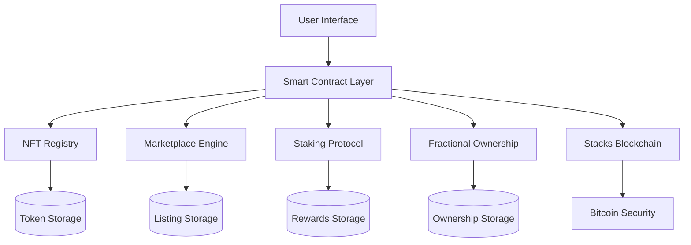

# DeFi Marketplace - NFT Collateralized Finance Platform

## Overview

DeFi Marketplace is a comprehensive Bitcoin-native NFT platform built on Stacks that revolutionizes digital asset management by combining traditional NFT functionality with sophisticated DeFi mechanisms. The platform enables collateralized NFT minting, marketplace trading, fractional ownership, and yield-generating staking with advanced risk management and protocol governance.

## Key Features

- **Collateralized NFT Minting**: Mint NFTs backed by STX collateral with configurable ratios
- **Integrated Marketplace**: Trade NFTs with built-in protocol fees and secure transfers
- **Fractional Ownership**: Democratize access through share-based ownership distribution
- **Yield-Generating Staking**: Earn consistent yields by staking NFTs in the protocol
- **Risk Management**: Robust collateral ratios and overflow protection mechanisms
- **Protocol Governance**: Comprehensive configuration and statistics tracking

## System Architecture

### Core Components



### Contract Architecture

The platform is built around five primary data structures that work together to provide comprehensive NFT and DeFi functionality:

#### 1. **NFT Registry (`tokens`)**

- Core token metadata and ownership tracking
- Collateral backing and staking status
- Fractional ownership share counts

#### 2. **Marketplace Engine (`token-listings`)**

- Active listing management
- Price discovery and trading execution
- Seller verification and status tracking

#### 3. **Fractional Ownership System (`fractional-ownership`)**

- Share-based ownership distribution
- Transfer and trading of ownership fractions
- Democratic access to high-value NFTs

#### 4. **Staking Protocol (`staking-rewards`)**

- Yield calculation and distribution  
- Reward accumulation tracking
- Staking period management

#### 5. **Protocol Configuration**

- Dynamic parameter management
- Fee structure and collateral ratios
- System-wide statistics and governance

## Data Flow

### NFT Minting Process

```
User Request → Collateral Validation → STX Transfer → Token Creation → Registry Update
```

1. **Validation**: URI format and collateral sufficiency checks
2. **Collateral Lock**: STX transferred to contract based on minimum ratio (150%)
3. **Token Creation**: New NFT minted with unique ID and metadata
4. **Registry Update**: Token information stored in core registry

### Marketplace Trading Flow

```
List NFT → Price Validation → Purchase Request → Fee Calculation → Ownership Transfer
```

1. **Listing Creation**: Owner sets price and activates marketplace listing
2. **Purchase Execution**: Buyer transfers STX, protocol fee calculated (2.5%)
3. **Settlement**: STX distributed to seller, fees to protocol, ownership transferred
4. **Cleanup**: Listing deactivated and registry updated

### Staking & Rewards System

```
Stake NFT → Reward Calculation → Yield Accumulation → Claim Distribution
```

1. **Staking Activation**: NFT locked in staking contract with timestamp
2. **Yield Calculation**: Block-based reward computation (5% annual rate)
3. **Reward Distribution**: STX rewards calculated and distributed to stakers
4. **Compound Growth**: Unclaimed rewards continue accumulating

## Technical Specifications

### Protocol Parameters

| Parameter | Default Value | Description |
|-----------|---------------|-------------|
| Minimum Collateral Ratio | 150% | Required STX backing for NFT minting |
| Protocol Fee | 2.5% | Marketplace transaction fee |
| Annual Yield Rate | 5% | Staking reward percentage |
| Maximum URI Length | 256 characters | NFT metadata URI limit |

### Error Handling

The contract implements comprehensive error handling across six categories:

- **Access Control** (100-101): Owner verification and authorization
- **Financial Operations** (102, 106): Balance and collateral validation  
- **NFT Operations** (103-105): Token validity and marketplace errors
- **Staking System** (107-108): Staking status and eligibility
- **Validation** (109-112): Input validation and overflow protection

### Security Features

- **Overflow Protection**: Mathematical operations secured against integer overflow
- **Access Control**: Multi-level permission system with owner verification
- **Collateral Management**: Automated collateral ratio enforcement
- **State Validation**: Comprehensive input and state validation checks

## API Reference

### Core Functions

#### NFT Operations

- `mint-nft(uri, collateral)` - Mint new NFT with collateral backing
- `transfer-nft(token-id, recipient)` - Transfer NFT ownership
- `get-token-info(token-id)` - Retrieve token metadata and status

#### Marketplace Functions  

- `list-nft(token-id, price)` - Create marketplace listing
- `purchase-nft(token-id)` - Execute NFT purchase
- `get-listing(token-id)` - Retrieve listing information

#### Staking Operations

- `stake-nft(token-id)` - Stake NFT for yield generation
- `unstake-nft(token-id)` - Remove NFT from staking
- `calculate-rewards(token-id)` - Calculate accumulated rewards

#### Fractional Ownership

- `transfer-shares(token-id, recipient, amount)` - Transfer ownership shares
- `get-fractional-shares(token-id, owner)` - Query ownership percentage

### Query Functions

- `get-protocol-stats()` - Retrieve system-wide statistics
- `get-staking-rewards(token-id)` - Query staking reward status

## Deployment Guide

### Prerequisites

- Stacks blockchain development environment
- Clarinet CLI tool for testing and deployment
- STX tokens for collateral and transaction fees

### Installation Steps

1. **Clone Repository**

```bash
git clone https://github.com/mandu-smith/defi-marketplace.git
cd defi-marketplace
```

2. **Install Dependencies**  

```bash
npm install
clarinet integrate
```

3. **Run Tests**

```bash
clarinet test
```

4. **Deploy Contract**

```bash
clarinet deploy --network=<network>
```

## Usage Examples

### Minting an NFT

```clarity
;; Mint NFT with 1000 STX collateral
(contract-call? .defi-marketplace mint-nft 
  "https://example.com/metadata.json" 
  u1000000000) ;; 1000 STX in microSTX
```

### Staking for Yield

```clarity
;; Stake NFT ID 1 for yield generation
(contract-call? .defi-marketplace stake-nft u1)

;; Check accumulated rewards
(contract-call? .defi-marketplace calculate-rewards u1)
```

### Marketplace Trading

```clarity
;; List NFT for 500 STX
(contract-call? .defi-marketplace list-nft u1 u500000000)

;; Purchase listed NFT
(contract-call? .defi-marketplace purchase-nft u1)
```

## Governance & Economics

### Fee Structure

- **Protocol Fee**: 2.5% on all marketplace transactions
- **Staking Rewards**: 5% annual yield on staked NFTs
- **Collateral Requirements**: 150% minimum backing ratio

### Revenue Model

The protocol generates revenue through:

1. Marketplace transaction fees (2.5%)
2. Collateral management fees
3. Premium feature access

## Security Considerations

### Audit Recommendations

- **Smart Contract Security**: Regular security audits recommended
- **Collateral Management**: Monitor collateral ratios and liquidation mechanisms  
- **Access Control**: Verify ownership and permission systems
- **Economic Security**: Assess tokenomics and incentive alignment

### Risk Mitigation

- Overflow protection on all mathematical operations
- Comprehensive input validation and error handling
- Multi-layered access control and ownership verification
- Collateral ratio enforcement and monitoring

## Contributing

We welcome contributions to the DeFi Marketplace platform. Please review our contribution guidelines and submit pull requests for review.

### Development Setup

1. Fork the repository
2. Create feature branch
3. Implement changes with tests
4. Submit pull request

## License

This project is licensed under the MIT License. See LICENSE file for details.

## Support & Documentation

For additional support and detailed documentation:

- **GitHub Issues**: Report bugs and feature requests
- **Documentation**: Comprehensive guides and API reference
- **Community**: Join our Discord for discussions and support

---

**DeFi Marketplace** - Revolutionizing NFT finance on Bitcoin through Stacks integration.
